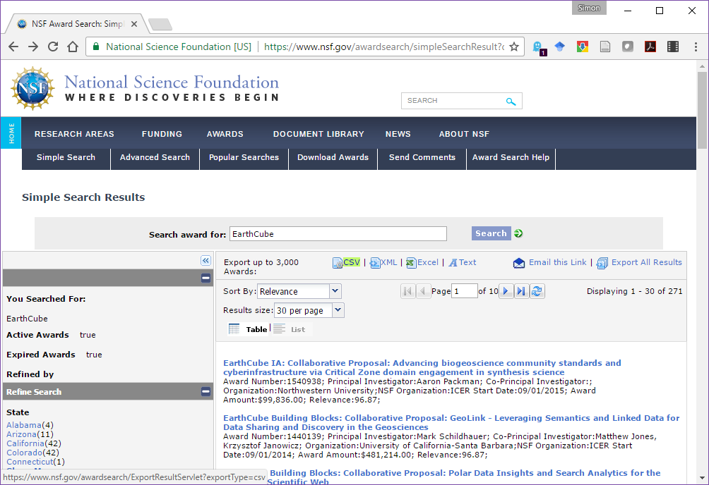
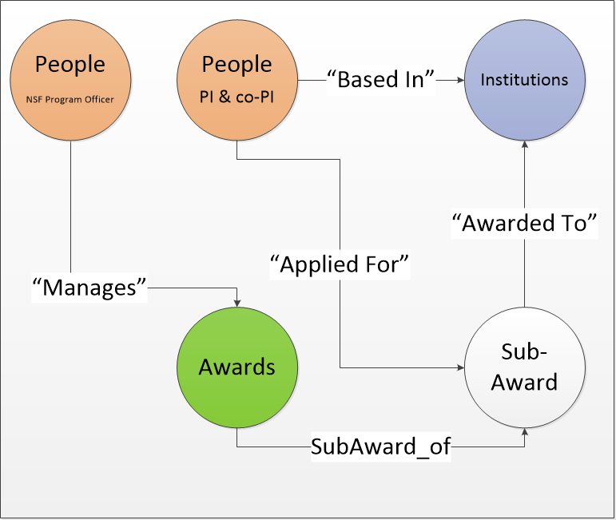

```{r setup, include=FALSE}
knitr::opts_chunk$set(echo = TRUE)
```

# Using Neo4j to Explore NSF EarthCube Awards

EarthCube is a set of funded projects, supported by NSF's Geosciences directorate and the Division of Advanced Cyberinfrastructure.  

# Obtaining the data

The National Sciences Foundation has a very handy Awards Search tool.  The [NSF Awards Search API documentation](http://www.research.gov/common/webapi/awardapisearch-v1.htm) is fairly well documented, and provides an opportunity for developing programmatic tools around awards searches.  I've developed this document as a one-off, and tried to use fairly straightforward approach, to focus the code around the use of the `RNeo4j` package, rather than the API wrapper.

To get the data I used the [NSF Awards Search web interface](https://www.nsf.gov/awardsearch/) and simply searched for any award (expired or active) that contained the term EarthCube.


Once this is done you get a set of results from projects that have included `"EarthCube"` in their text somewhere, or are funded through the EarthCube program at the NSF level (as opposed to the EarthCube Governance).  The returned list can be exported to one of several formats. 



For this project I've exported the results to `csv`, and the file is available from the [GitHub repository for this project](http://hithub.com/EC_Engagement) as a [raw CSV file]().

# A Brief Introduction to Neo4j and Graph Databases

[Neo4j](https://neo4j.com) is a provider for a particular kind of database called a [graph database]().  A graph database models data through relationships. In the context of NSF Grants we can think of objects, such as people, or institutions or awards, and we can think of their relationships to one another.  For example, the *Person* "Simon Goring" has a relationship with the *Institution* "University of Wisconsin", which is that I "Work For" the University.  Similarly, I have a relationship with *Award* 1541002, in that I am a "Co-PI".  In defining these **node**s, and the **relationships** between them, we can begin to develop a data model for these awards.  

# Defining the Model

Once the data is loaded, we need to define a model, and data content for each element.  This project uses a fairly simple data model, focusing on people, places and awards.



While the individual nodes are fairly straightforward, we can pull out specific nodes and examine how the information in the awards `csv` file ould fit into them.  This is also the first time we get to look at the data in some detail.  Although the data contains personal information, it is within the public domain.  However, I will focus on the data that directly pertains to myself.

```{r}
funded_project <- read.csv('Awards.csv', stringsAsFactors = FALSE)

# Find the row that includes my data:
my_row <- grep("Simon Goring", funded_project$Co.PIName.s.)

```

The raw data has `r ncol(funded_project)` columns.  Of these, `ProgramManager`, `PrincipalInvestigator`, and `CO.PIName.s.` are the named fields.  The NSF data does not contain a significant amount of data, although it does include an email address for the lead PI at each institution.  For the sake of this exercise we'll ignore that.  To clean the names we need to recognize that the `CO.PIName.s.` may be comma separated:

```{r}
funded_project$Co.PIName.s.[my_row]
```

To generate a list of all unique individuals, we can write a pretty short script.  This can define both the individual, and also a count of the total grants they are a part of, if you want to use this for visualization.

```{r}

library(dplyr, verbose = FALSE, quietly = TRUE)
library(purrr, verbose = FALSE, quietly = TRUE)

people <- c(funded_project$PrincipalInvestigator, 
            funded_project$ProgramManager,
            unlist(strsplit(funded_project$Co.PIName.s., ', '))) %>% 
  data.frame(name = .) %>% 
  group_by(name) %>% 
  summarise(count = n())

knitr::kable(people[grep("Simon", people$name),])
```

We can do the same thing for Organizations, although this is simplified since NSF provides a single award number per organization:

```{r}
# Organizations:
orgs <- funded_project %>% 
  dplyr::select(Organization, OrganizationState, OrganizationCity) %>% 
  group_by(Organization, OrganizationState, OrganizationCity) %>% 
  summarise(count = n())

knitr::kable(head(orgs))
```

The last nodes to be generated are the awards:

```{r}

grants <- funded_project %>% 
  select(AwardNumber,
         Title,
         StartDate,
         EndDate,
         AwardedAmountToDate,
         Abstract)

grants$URL <- paste0("http://nsf.gov/awardsearch/showAward?AWD_ID=", 
                                       funded_project$AwardNumber)


# There is an issue with near-duplicate grant titles.  Contributing institutions should be submitting
#  grants with titles that are equivalent.  In practice, there are near-duplicate titles.
#  I solve this in a lazy way, by finding near matches and then picking the most common near match.

library(stringdist)

getmode <- function(v) {
   uniqv <- unique(v)
   uniqv[which.max(tabulate(match(v, uniqv)))]
}

for (i in 1:nrow(grants)) {
  matches <- stringdist(tolower(grants$Title[i]), tolower(grants$Title))
  if (sum(matches < 5) > 1) {
    grants$Title[matches < 5] <- grants$Title[which(matches == getmode(matches[matches < 5]))[1]]
  }
}

```

Given this, and the `funded_project` table structure we can move to the process of building the database.  Since each element here is pulled from the table, we can use the table's structure to build the graph.  This first requires us to initialize the database, and then begin to populate it:

```{r}

library(RNeo4j)

# These are the default settings, in general I like to have my username and password
# in a seperate file that I then call using `scan`:

ec_graph <- startGraph("http://localhost:7474/db/data", username = "neo4j", password = "NeoPW")

clear(ec_graph, input = FALSE)
```

In general, there's no need to `clear()` the graph, except that I've run this a few times & don't want to overwrite it, without making sure that all the old information is gone.

So now, we have the elements, we have the relationship types, and now we need to begin to build the database.  Given an empty graph we can begin by looping through each award (each `grant` element).  To do this, we will find the individual award, and begin to populate the graph, element by element.  Since we don't want to create duplicate nodes or relationships, we want to always check if a particular node exists, and then decide whether to, either create the node, or pass on a `NULL` value.

```{r}

checkNode <- function(x, graph, type) {
  node_gr <- getNodes(graph, 
               paste0("MATCH (t:",type, ") WHERE t.",names(x)[1]," IN ['", x[1], 
               "'] RETURN t"))
  if (is.null(node_gr)) {
    node_gr <- createNode(graph = graph, .label = type, x)
  }
  
  return(node_gr)
  
}

```

Now we build all the nodes!
```{r}

people_nodes <- people %>% by_row(checkNode, graph = ec_graph, type = "Person")
organization <- orgs   %>% by_row(checkNode, graph = ec_graph, type = "Organization")


build_nodes <- function(x, graph) {

  row_match <- match(x$AwardNumber, funded_project$AwardNumber)
  
  folks <- c(funded_project$PrincipalInvestigator[row_match],
             funded_project$ProgramManager[row_match],
             unlist(strsplit(funded_project$Co.PIName.s.[row_match], ', ')))
  
  people_gr   <- people[match(folks, people$name),] %>% 
    purrr::by_row(checkNode, graph = ec_graph, type = "Person")
  
  org_gr      <- orgs[match(funded_project$Organization[row_match], orgs$Organization),] %>%
    purrr::by_row(checkNode, graph = ec_graph, type = "Organization")
  
  subaward_gr    <- checkNode(x %>% select(AwardNumber, AwardedAmountToDate, URL), graph, "Sub_Award")
  
  award_gr    <- checkNode(x %>% select(Title, Abstract, StartDate, EndDate), graph, "Award")

  # Build the relationships:
  
  createRel(.toNode = award_gr, .relType = "Subaward_of", .fromNode = subaward_gr)

  
  
  # Funded individuals are based at institutions:
  ## Not sure if I should cut this, it looks like people are associated with multiple
  ## institutions through grants.
  lapply(people_gr, 
         function(x) { createRel(.fromNode = x, .relType = "Based_In", .toNode = org_gr[[1]]) })
  
    
}

```

```r

createNode(ec_graph, .label = "Grants", as.list(grants[1,]))

```

```