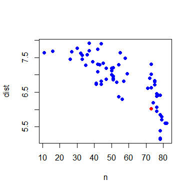

# EarthCube Funded Projects
Simon Goring  
November 17, 2016  


# Using Neo4j to Explore NSF EarthCube Awards

[EarthCube](http://earthcube.org) is a set of funded projects, supported by NSF's Geosciences directorate and the Division of Advanced Cyberinfrastructure.  EarthCube is defined as *"a community effort to promote interdisciplinary geoscience by enabling technology, organization, and culture that facilitates connectivity through standards and protocols to existing and emerging resources."*, so I thought I would take the opportunity to leverage a few emerging technologies to look at connectivity across the organization.

I've been involved with EarthCube since an early workshop at the University of Wisconsin focused on community standards for geochronology, user needs and capacity building.  Since then I have been co-PI on an award to help integrate the [Neotoma Paleoecological Database](http://neotomadb.org) and [Paleobiology Database](https://paleobiodb.org/#/) through a common API (currently in development as the [EarthLife Consortium](http://earthlifeconsortium.org)).  I currently sit on EarthCube's Leadership Committee, so, as much as this post is driven by my own interest, it's also got an element of propaganda to it.

# Obtaining the Data

## The Search Tool

The National Sciences Foundation has a very handy Awards Search tool.  The [NSF Awards Search API documentation](http://www.research.gov/common/webapi/awardapisearch-v1.htm) is fairly well documented, and provides an opportunity for developing programmatic tools around awards searches.  I've developed this document as a one-off, and tried to use fairly straightforward approach, to focus the code around the use of the `RNeo4j` package, rather than the API wrapper.

To get the data I used the [NSF Awards Search web interface](https://www.nsf.gov/awardsearch/) and simply searched for any award (expired or active) that contained the term EarthCube.


Once this is done you get a set of results from projects that have included `"EarthCube"` in their text somewhere, or are funded through the EarthCube program at the NSF level (as opposed to the EarthCube Governance).  The returned list can be exported to one of several formats. 


For this project I've exported the results to `csv`, and the file is available from the [GitHub repository for this project](http://hithub.com/EC_Engagement) as a [raw CSV file]().

# A Brief Introduction to Neo4j and Graph Databases

[Neo4j](https://neo4j.com) is a provider for a particular kind of database called a [graph database](https://en.wikipedia.org/wiki/Graph_database).  A graph database models data through relationships. In the context of NSF Grants we can think of objects, such as people, or institutions or awards, and we can think of their relationships to one another.  For example, the *Person* "Simon Goring" has a relationship with the *Institution* "University of Wisconsin", which is that I "Work For" the University.  Similarly, I have a relationship with *Award* 1541002, in that I am a "Co-PI".  In defining these **node**s, and the **relationships** between them, we can begin to develop a data model for these awards.  

Since we're building in R, I'm using the [`Rneo4j` package](http://www.rdocumentation.org/packages/RNeo4j).  The author of the package, data scientist [Nicole White](https://twitter.com/_nicolemargaret), has some nice [tutorials for using the Rneo4j package](https://neo4j.com/developer/r/).

This document takes some of those basics, adds a (semi) scientific dataset, and (hopefully) provides you with another example for building a graph database with `neo4j`.

# Defining the Model

Once the data is loaded, we need to define a model, and data content for each element.  This project uses a fairly simple data model, focusing on people, places and awards.


While the individual nodes are fairly straightforward, we can pull out specific nodes and examine how the information in the awards `csv` file ould fit into them.  This is also the first time we get to look at the data in some detail.  Although the data contains personal information, it is within the public domain.  However, I will focus on the data that directly pertains to myself.


```r
library(dplyr, verbose = FALSE, quietly = TRUE)
library(purrr, verbose = FALSE, quietly = TRUE)

funded_project <- read.csv('Awards.csv', stringsAsFactors = FALSE) %>% mutate_all(as.character)

# Find the row that includes my data:
my_row <- grep("Simon Goring", funded_project$Co.PIName.s.)
```

## Cleaning the Data

The raw data has 25 columns.  Of these, `ProgramManager`, `PrincipalInvestigator`, and `CO.PIName.s.` are the named fields (this is the annoying R behaviour of switching in periods).  The NSF report does not contain a significant amount of data, although it does include an email address for the lead PI at each institution.  For the sake of this exercise we'll ignore that.  To clean the names we need to recognize that the `CO.PIName.s.` may be comma separated:


```r
funded_project$Co.PIName.s.[my_row]
```

```
## [1] "Simon Goring, Shanan Peters"
```

To generate a list of all unique individuals, we can write a pretty short script.  This can define both the individual, and also a count of the total grants they are a part of, if you want to use this for visualization.


```r
people <- c(funded_project$PrincipalInvestigator, 
            funded_project$ProgramManager,
            unlist(strsplit(funded_project$Co.PIName.s., ', '))) %>% 
  data.frame(name = .) %>% 
  group_by(name) %>% 
  summarise(count = n())

knitr::kable(people[grep("Simon", people$name),])
```


name            count
-------------  ------
Simon Goring        1

We can do the same thing for Organizations, although this is simplified since NSF provides a single award number per organization:


```r
# Organizations:
orgs <- funded_project %>% 
  dplyr::select(Organization, OrganizationState, OrganizationCity) %>% 
  group_by(Organization, OrganizationState, OrganizationCity) %>% 
  summarise(count = n())

knitr::kable(head(orgs))
```


Organization                         OrganizationState   OrganizationCity    count
-----------------------------------  ------------------  -----------------  ------
American Museum Natural History      NY                  New York                1
Arizona Geological Survey            AZ                  Tucson                  3
Arizona State University             AZ                  TEMPE                   4
Boise State University               ID                  boise                   1
Brown University                     RI                  Providence              1
California Institute of Technology   CA                  PASADENA                2

The last nodes to be generated are the awards:


```r
grants <- funded_project %>% 
  select(AwardNumber,
         Title,
         StartDate,
         EndDate,
         AwardedAmountToDate,
         Abstract)

grants$URL <- paste0("http://nsf.gov/awardsearch/showAward?AWD_ID=", 
                                       funded_project$AwardNumber)
```

In general the data output is pretty straightforward.  The one issue I found was an artifact of the way proposals are awarded.  In practice, you write a single grant, but submit a different grant for each institution.  This means that there is one parent-award, and then a set of sub-awards.  We would expect that all sub-awards have the same title, but this isn't the case, or at least, not quite the case.  Some preliminary string matching showed me that there's often an edit distance of $d_{e} < 10$ among sub-awards.  I wanted to standardize titles before I got too far, so I used the [`stringsidt` R package](http://www.markvanderloo.eu/yaRb/2013/02/26/the-stringdist-package/).


```r
library(stringdist)

getmode <- function(v) {
   uniqv <- unique(v)
   uniqv[which.max(tabulate(match(v, uniqv)))]
}

for (i in 1:nrow(grants)) {
  
  # Index through each title, matching against all other titles:
  matches <- stringdist(tolower(grants$Title[i]), tolower(grants$Title))
  
  if (sum(matches < 5) > 1) {
    # Look for matches with an edit distance of < 5.
    grants$Title[matches < 5] <- grants$Title[which(matches == getmode(matches[matches < 5]))[1]]
    funded_project$Title[matches < 5] <- grants$Title[which(matches == getmode(matches[matches < 5]))[1]]
  }
}
```

# Building the Graph

Once we've cleaned the data (minimally) and understand the `funded_project` table structure, we can move to the process of building the database.  Since each element here is pulled from the table, we can use the table's structure to build the graph.  This first requires us to initialize the database, and then begin to populate it.  Before I ran this code I started an instance of `neo4j`.  My instance is accessed through port `7474`:


```r
library(RNeo4j)

# These are the default settings, in general I like to have my username and password
# in a seperate file that I then call using `scan`:

ec_graph <- startGraph("http://localhost:7474/db/data", username = "neo4j", password = "NeoPW")

clear(ec_graph, input = FALSE)
```

In general, there's no need to `clear()` the graph, except that I've run this a few times & don't want to overwrite it, without making sure that all the old information is gone.

So now, we have the elements, we have the relationship types, and now we need to begin to populate the graph.  Given an empty graph we can begin by looping through each award (each `grant` element).  To do this, we will find the individual award, and begin to populate the graph, element by element.  Since we don't want to create duplicate nodes or relationships, we want to always check if a particular node exists, and then decide whether to, either create the node, or pass on a `NULL` value.

I didn't find a good tool to do this using `RNeo4j`, you can do it afterwards, clearing duplicate nodes, but my laptop is pretty old at this point, so I wanted to keep the overhead down.  To do that I wrote two helper functions, `checkNode()`, which checks for a node in the graph before it adds it in, and `checkRel()`, which does the same thing for relationships.


```r
checkNode <- function(x, graph, type) {
  node_gr <- getNodes(graph, 
               paste0("MATCH (t:",type, ") WHERE t.",names(x)[1]," IN ['", gsub("'", '"', x[1]), 
               "'] RETURN t"))
  if (is.null(node_gr)) {
    node_gr <- createNode(graph = graph, .label = type, x)
  }
  
  return(node_gr)
  
}

checkRel <- function(x, y, type, graph) {
  rel_check <- getRels(graph, 
               paste0("MATCH (x:",getLabel(x), ")-[r]-(y:",getLabel(y), ") WHERE x.",
                      names(x)[1]," IN ['", gsub("'", '"', x[1]), 
                      "'] AND y.",
                      names(y)[1]," IN ['", gsub("'", '"', y[1]), 
                      "'] RETURN r"))
  if (is.null(rel_check)) {
    rel_check <- createRel(.fromNode = x, .relType = type, .toNode = y)
  }
  
  return(rel_check)
}
```

Once those functions are loaded we add in all the nodes using `purrr`'s really nice `by_row` function to go through each row of the `people`, `orgs`, and `grants` `data.frame`s.


```r
people_nodes <- people %>% by_row(checkNode, graph = ec_graph, type = "Person")
organization <- orgs   %>% by_row(checkNode, graph = ec_graph, type = "Organization")

subaward_gr    <- grants %>% 
  select(AwardNumber, AwardedAmountToDate, URL) %>% 
  by_row(checkNode, graph = ec_graph, "Sub_Award")
  
award_gr    <- grants %>% 
  select(Title, Abstract, StartDate, EndDate) %>% 
  by_row(checkNode, graph = ec_graph, "Award")
```

In general these steps each take a fairly significant amount of time.  It's faster when I `render()` with `rmarkdown`, but slow when I run it natively in RStudio.  I suspect that some of this is the result of first attempting to check if nodes are duplicates, some of it is my laptop.  Given that we are creating these from scratch it's probably fine to assume each node is new and skip the matching.  Having said that, it's nice to be sure that everything is working cleanly from the start.

So, once the nodes are build, we go row-wise and build the relationships:


```r
for (i in 1:nrow(grants)) {
  
  # Find out who was funded on that grant:
  people_gr <- getNodes(ec_graph, 
                 paste0("MATCH (p:Person) WHERE p.name IN ['", 
                 paste(gsub("'", ".", unique(c(funded_project$PrincipalInvestigator[i],
                        strsplit(funded_project$Co.PIName.s.[i], split = ', ')[[1]]))), 
                       collapse = "','"), 
                 "'] RETURN p"))
  
  # Grant funds go to institutions:
  org_gr <-  getSingleNode(ec_graph, 
                      paste0("MATCH (o:Organization) WHERE o.Organization IN ['", 
                             as.character(unique(funded_project$Organization[i])), 
                             "'] RETURN o"))
  
  award_gr <- getSingleNode(ec_graph, 
                      paste0('MATCH (a:Award) WHERE a.Title IN ["', 
                             as.character(funded_project$Title[i]), 
                             '"] RETURN a'))
  
  subaw_gr <- getSingleNode(ec_graph, 
                            paste0("MATCH (s:Sub_Award) WHERE s.AwardNumber = '", 
                                   funded_project$AwardNumber[i], 
                                   "' RETURN s"))
  
  # Funded individuals are based at institutions:
  ## Not sure if I should cut this, it looks like people are associated with multiple
  ## institutions through grants.
  lapply(people_gr, 
         function(x) { checkRel(x = x, y = org_gr, type = "Based_At", graph = ec_graph) })
  
  checkRel(x = subaw_gr, y = org_gr,   type = "Awarded_to",  graph = ec_graph)
  
  checkRel(x = subaw_gr, y = award_gr, type = "Subaward_of", graph = ec_graph)
  
  # Funded individuals apply for the grants:
  lapply(people_gr, 
         function(x) { checkRel(x = x, y = subaw_gr, type = "Applied_for", graph = ec_graph) })
  
  # A program officer manages the awards:
  
  po_gr <- getSingleNode(ec_graph, 
                         paste0("MATCH (p:Person) WHERE p.name IN ['",
                                unique(funded_project$ProgramManager[i]),
                                "'] RETURN p"))

  checkRel(x = po_gr, y = award_gr, type = "Manages", graph = ec_graph)

}
```

This is a pretty ugly way of doing it. There's probably an easier way, but I've run into problems with matching up elements of the `list`s returned by  `getNodes` to the data in the `funded_project` table to the unique node lists.  Ultimately, I went back and just decided to make a big loop.  In some ways (hopefully!) this makes things a bit more transparent if you're just learning how to do this.

# Checking that things worked

We can take a look at a local network, given that we've built the full graph.  Let's use the cypher query language developed by `neo4j` to take a look a one local network:


```r
rels <- getRels(graph = ec_graph, 
                  query = paste0('MATCH ptp = (p:Person {name:"Simon Goring"})-[*0..2]-(pp:Person)',
                                 'RETURN relationships(ptp)'))

nodes <- getNodes(graph = ec_graph, 
                  query = paste0('MATCH ptp = (p:Person {name:"Simon Goring"})-[*0..2]-(pp:Person)',
                                 'RETURN nodes(ptp)'))

node_edge <- function(node, edge) {
 
 nodes <- lapply(1:length(node), function(x){
   data.frame(id   = sapply(node[[x]], function(y) y$metadata$id),
              type = sapply(node[[x]], function(y) y$metadata$labels[[1]]), 
              name = sapply(node[[x]], 
                            function(y) {
                              if (y$metadata$labels %in% "Person") return(y$data$name)
                              if (y$metadata$labels %in% "Organization") return(y$data$Organization)
                              if (y$metadata$labels %in% "Sub_Award")    return(y$data$AwardNumber)
                              if (y$metadata$labels %in% "Award")    return(y$data$Title)}),
              count = sapply(node[[x]], function(y) ifelse(y$metadata$labels %in% c("Sub_Award", "Award"), 
                                                           1, y$data$count)))})
 
 nodes <- nodes %>% bind_rows() %>% unique()
 
 edges <- lapply(1:length(edge), function(x) {
   if (length(edge[[x]]) == 0) return(NULL)
   data.frame(source = sapply(edge[[x]], function(y) stringr::str_extract(y$start, "[0-9]*$")),
              target = sapply(edge[[x]], function(y) stringr::str_extract(y$end, "[0-9]*$")))
 })
 
 edges <- edges %>% bind_rows() %>% unique()
 
 nodes$newID <- seq(0, nrow(nodes) - 1)
 
 edges$newSource <- nodes$newID[match(edges$source, nodes$id)]
 edges$newTarget <- nodes$newID[match(edges$target, nodes$id)]
 
 edges <- edges[order(edges$newTarget),]

 return(list(nodes = nodes, edges = edges))
}

summary_graph <- node_edge(nodes, rels)

summary_graph$nodes$type[which(summary_graph$nodes$name == "Simon Goring")] <- "Me"

networkD3::forceNetwork(Links  = summary_graph$edges,
                        Nodes  = summary_graph$nodes,
                        Source = "newSource",
                        Target = "newTarget",
                        NodeID = "name",
                        Nodesize = "count",
                        Group  = "type",
                        linkWidth = 1,
                        opacity = 1,
                        zoom = TRUE,
                        height = 400,
                        width = 400,
                        legend = TRUE)
```

So, the process to get the data into `networkD3` isn't super straightforward.  I had to write a little function to break apart the cypher queries.  But regardless, you can now see my local network. Other cypher queries could be used to generate other patterns.  For example, we could find out how close organizations are to one another.

# Institutional Proximity

To understand how tightly insitutions are connected through EarthCube grants we have to construct a cypher query that checks distances across the network.  We pair `Organization`s, ensuring that the start (`o1`) and end (`o2`) organizations are not the same.  I added the extra constraint for the path that it not pass through an NSF Program officer.  This is why we use the `NONE` and `type(rels)='Manages` constraint.  A program officer is a `Person`, so we can't eliminate them on that basis (and it makes sense they are a `Person` since Program Officers come from academia, and so theoretically could also apply for grants).

We search for paths up to 9 steps in length (`[*..9]`), obtaining the shortest path in each case (we could use `allShortestPaths` if we wanted multiple options, but here we just care about the end points and their length).


```r
path_dist <- cypher(graph = ec_graph, query = "MATCH (o:Organization)
  WITH collect(ID(o)) AS orgs
  MATCH (o1:Organization), (o2:Organization)
  MATCH path=shortestPath((o1)-[*..9]-(o2))
  WHERE ID(o1) IN orgs AND ID(o2) IN orgs AND o1 <> o2
  AND NONE(rel in rels(path) WHERE type(rel)='Manages')
  RETURN o1.Organization AS start, o2.Organization AS end, length(path) AS steps")

avg_dist <- path_dist %>% 
  group_by(start) %>% 
  summarise(dist = mean(steps), n = n()) %>% 
  arrange(dist) %>% filter(n > 10)

knitr::kable(head(avg_dist, n = 10))
```


start                                                    dist    n
--------------------------------------------------  ---------  ---
Columbia University                                  5.141026   78
University of Colorado at Boulder                    5.166667   78
Arizona Geological Survey                            5.384615   78
Stroud Water Research Center                         5.604938   81
Utah State University                                5.609756   82
Incorporated Research Institutions for Seismology    5.708861   79
University Corporation For Atmospheric Res           5.797468   79
University of Southern California                    5.846154   78
University of Texas at Austin                        5.947368   76
University of Wisconsin-Madison                      6.027397   73

I'm just showing the ten institutions with the closest paths to other institutions.  I'm happy to report that UW-Madison is one of them!

Given a bit of knowedge about EarthCube and the funded projects, it makes sense that many of these universities and institutions are at the top of the list.  The average distance between institutions is about 7 steps, with 16 institutions failing to find close neighbors within 9 steps. In general this is because the organization only ever participated in single-institution proposals with EarthCube, and the PIs were not involved in other EarthCube proposals.  An additional wrinkle is that the proposals examined here contained the term "EarthCube" anywhere within the data, including in the abstract.  It's possible that unrelated projects that referred to standards coming out of EarthCube could have been counted here.  Regardless, that's more a statement about the impact of the EarthCube program than anything else.

Mean path length is tightly coupled to the number of institutions an institution is connected to.  This makes sense intuitively, but the relationship has an interesting sharp downward curve:


```r
plot(dist ~ n, data = avg_dist, pch = 19, col = ifelse(avg_dist$start == "University of Wisconsin-Madison", 2, 4))
```

<!-- -->

# One Last Pretty Graph


```r
rels <- getRels(graph = ec_graph, 
                  query = paste0('MATCH ptp = (p:Person {name:"Simon Goring"})-[*0..5]-(pp:Person)',
                                 'RETURN relationships(ptp)'))

nodes <- getNodes(graph = ec_graph, 
                  query = paste0('MATCH ptp = (p:Person {name:"Simon Goring"})-[*0..5]-(pp:Person)',
                                 'RETURN nodes(ptp)'))

summary_graph <- node_edge(nodes, rels)

summary_graph$nodes$type[which(summary_graph$nodes$name == "Simon Goring")] <- "Me"

networkD3::forceNetwork(Links  = summary_graph$edges,
                        Nodes  = summary_graph$nodes,
                        Source = "newSource",
                        Target = "newTarget",
                        NodeID = "name",
                        Nodesize = "count",
                        Group  = "type",
                        linkWidth = 1,
                        opacity = 1,
                        zoom = TRUE,
                        height = 600,
                        width = 700,
                        legend = TRUE)
```

<!--html_preserve--><div id="htmlwidget-cfb007a58d4b89b8b0ee" style="width:700px;height:600px;" class="forceNetwork html-widget"></div>
<script type="application/json" data-for="htmlwidget-cfb007a58d4b89b8b0ee">{"x":{"links":{"source":[0,2,3,4,5,6,7,8,9,10,11,12,13,16,17,18,19,48,101,2,4,3,15,4,5,6,4,4,8,0,4,5,6,6,21,22,23,24,25,26,27,28,29,30,31,32,33,34,35,36,37,38,39,40,41,42,43,44,45,21,23,24,25,26,28,29,29,29,28,6,34,29,21,29,21,37,38,39,29,41,42,43,44,33,47,7,7,50,51,52,53,54,50,7,51,52,53,48,56,58,60,62,57,59,61,63,64,65,8,67,68,69,70,71,72,73,74,75,76,77,78,79,80,81,82,83,84,85,86,87,88,89,67,68,69,70,67,72,69,74,8,67,75,67,77,70,67,72,69,68,72,69,70,84,86,67,87,69,70,88,18,91,93,95,98,99,92,94,96,97,75,100,9,10,11,12,13,101,103,91,92,93,94,106,107,95,37,109,110,111,112,113,96,97,114,98,116,117,118,119,120,121,122,123,124,125,75,126,99,100],"target":[1,1,1,1,1,1,1,1,1,1,1,1,1,1,1,1,1,1,1,3,3,14,14,16,16,16,17,18,18,18,19,19,19,20,20,20,20,20,20,20,20,20,20,20,20,20,20,20,20,20,20,20,20,20,20,20,20,20,20,22,27,27,27,27,30,30,31,32,33,33,35,35,36,36,40,40,40,40,40,45,45,45,45,46,46,48,49,49,49,49,49,49,54,54,54,54,54,55,55,55,55,55,56,58,60,62,62,62,66,66,66,66,66,66,66,66,66,66,66,66,66,66,66,66,66,66,66,66,66,66,66,66,71,71,71,71,73,73,73,76,76,76,76,78,78,79,80,81,81,82,83,83,83,85,89,89,89,89,89,89,90,90,90,90,90,90,91,93,95,95,98,99,101,101,101,101,101,102,102,104,104,105,105,105,105,108,108,108,108,108,108,108,108,108,108,115,115,115,115,115,115,115,115,115,115,115,115,115,127,127],"colour":["#666","#666","#666","#666","#666","#666","#666","#666","#666","#666","#666","#666","#666","#666","#666","#666","#666","#666","#666","#666","#666","#666","#666","#666","#666","#666","#666","#666","#666","#666","#666","#666","#666","#666","#666","#666","#666","#666","#666","#666","#666","#666","#666","#666","#666","#666","#666","#666","#666","#666","#666","#666","#666","#666","#666","#666","#666","#666","#666","#666","#666","#666","#666","#666","#666","#666","#666","#666","#666","#666","#666","#666","#666","#666","#666","#666","#666","#666","#666","#666","#666","#666","#666","#666","#666","#666","#666","#666","#666","#666","#666","#666","#666","#666","#666","#666","#666","#666","#666","#666","#666","#666","#666","#666","#666","#666","#666","#666","#666","#666","#666","#666","#666","#666","#666","#666","#666","#666","#666","#666","#666","#666","#666","#666","#666","#666","#666","#666","#666","#666","#666","#666","#666","#666","#666","#666","#666","#666","#666","#666","#666","#666","#666","#666","#666","#666","#666","#666","#666","#666","#666","#666","#666","#666","#666","#666","#666","#666","#666","#666","#666","#666","#666","#666","#666","#666","#666","#666","#666","#666","#666","#666","#666","#666","#666","#666","#666","#666","#666","#666","#666","#666","#666","#666","#666","#666","#666","#666","#666","#666","#666","#666","#666","#666","#666","#666","#666","#666","#666","#666","#666","#666","#666","#666","#666","#666","#666","#666","#666","#666"]},"nodes":{"name":["Simon Goring","University of Wisconsin-Madison","Bradley Singer","1343130","Shanan Peters","Christopher Re","Miron Livny","Basil Tikoff","John Williams","Gary Berg-Cross","James Wilson","Mike Dean","Naijun Zhou","Nancy Wiegand","EarthCube domain end-user workshop: Bringing Geochronology into the EarthCube framework","Russell C. Kelz","1343760","1440312","1541002","1242902","University of Southern California","Chris Mattmann","1639753","E. Virginia Armbrust","Edward DeLong","John Heidelberg","Katrina Edwards","1341418","Ewa Deelman","Yolanda Gil","1238216","1540937","1533930","1256100","Julien Emile-Geay","1541029","1440323","Christopher Duffy","Erin Robinson","Scott Peckham","1343800","Kim Olsen","Ricardo Taborda","Thomas Jordan","Yifeng Cui","1450451","The Role of Software and Software Institutes in Computational Science Over Time","Daniel Katz","1639549","Sonoma State University","Amy Ellwein","James Bowring","Matty Mookerjee","Thomas Shipley","1340265","EarthCube Data Infrastructure: Collaborative Proposal: Development of an Integrated Data System for the Geological Field Sciences","1639724","Allen Glazner","1639686","Frank Spear","1639682","Marjorie Chan","1639734","Diane Kamola","J. Douglas Walker","Warren Alexander","Columbia University","Kerstin Lehnert","Leslie Hsu","Suzanne Carbotte","Vicki Ferrini","1541022","Robert Arko","1440221","Christopher Jenkins","Mark Uhen","1340301","Yue Cai","1440351","1338760","1321723","1354990","1440229","1341929","Marc Spiegelman","1550337","Karin Block","Stephen Richard","William Ryan","950477","EarthCube IA: Collaborative Proposal: Building Interoperable Cyberinfrastructure (CI) at the Interface between Paleogeoinformatics and Bioinformatics","1540977","Jessica Blois","1541015","Edward Davis","1540979","Brian Bills","Russell Graham","1540997","1540994","Alison Smith","955816","INTEROP--Spatial Ontology Community of Practice: an Interdisciplinary Network to Support Geospatial Data Sharing, Integration, and Interoperability","Robert Chadduck","University of California - Merced","University of Oregon Eugene","David Sutherland","Twila Moon","Pennsylvania State Univ University Park","Elizabeth Hajek","Chris Marone","Jay Bass","Guido Cervone","Michael Mann","Steven Greybush","George Mason University","Chaowei Yang","Akua Asa-Awuku","Athanasios Nenes","Liping Di","Stefan Falke","Chen Xu","Ben Domenico","Haosheng Huang","Quansong Tong","Xiaoqing Wu","James Kinter","Kent State University"],"group":["Me","Organization","Person","Sub_Award","Person","Person","Person","Person","Person","Person","Person","Person","Person","Person","Award","Person","Sub_Award","Sub_Award","Sub_Award","Sub_Award","Organization","Person","Sub_Award","Person","Person","Person","Person","Sub_Award","Person","Person","Sub_Award","Sub_Award","Sub_Award","Sub_Award","Person","Sub_Award","Sub_Award","Person","Person","Person","Sub_Award","Person","Person","Person","Person","Sub_Award","Award","Person","Sub_Award","Organization","Person","Person","Person","Person","Sub_Award","Award","Sub_Award","Person","Sub_Award","Person","Sub_Award","Person","Sub_Award","Person","Person","Person","Organization","Person","Person","Person","Person","Sub_Award","Person","Sub_Award","Person","Person","Sub_Award","Person","Sub_Award","Sub_Award","Sub_Award","Sub_Award","Sub_Award","Sub_Award","Person","Sub_Award","Person","Person","Person","Sub_Award","Award","Sub_Award","Person","Sub_Award","Person","Sub_Award","Person","Person","Sub_Award","Sub_Award","Person","Sub_Award","Award","Person","Organization","Organization","Person","Person","Organization","Person","Person","Person","Person","Person","Person","Organization","Person","Person","Person","Person","Person","Person","Person","Person","Person","Person","Person","Organization"],"nodesize":[1,7,1,1,6,2,3,2,2,1,1,1,1,1,1,7,1,1,1,1,10,3,1,1,2,1,1,1,2,6,1,1,1,1,1,1,1,4,2,7,1,1,1,1,1,1,1,2,1,1,1,3,1,1,1,1,1,1,1,2,1,2,1,1,2,1,11,9,3,6,4,1,3,1,3,3,1,1,1,1,1,1,1,1,1,1,1,1,1,1,1,1,1,1,1,1,1,1,1,1,1,1,1,1,1,2,1,1,7,1,1,1,1,1,1,8,2,1,1,3,1,1,1,1,1,1,1,1]},"options":{"NodeID":"name","Group":"type","colourScale":"d3.scale.category20()","fontSize":7,"fontFamily":"serif","clickTextSize":17.5,"linkDistance":50,"linkWidth":"1","charge":-120,"opacity":1,"zoom":true,"legend":true,"nodesize":true,"radiusCalculation":" Math.sqrt(d.nodesize)+6","bounded":false,"opacityNoHover":0,"clickAction":null}},"evals":[],"jsHooks":[]}</script><!--/html_preserve-->

Here you can see the path that links me to other EarthCube researchers.  Lots of it runs through our Integrative Activities Grant, but also through the University of Wisconsin as a hub for connections.

# Conclusions

This is my first real deep-dive into using `neo4j`, but it was pretty fun.  I didn't show you the user interface, but the browser is nice and clean, and relatively easy to use.  I crashed Chrome a few times while testing out some of my cypher queries, but re-connecting to the database was super simple.

I feel like either I need to get more comfortable with the `RNeo4j` tools, or the package could use some more helper functions.  Better integration with packages like `networkD3` or `igraph` would be fantastic.  That said, take a look at my hacky code and let me know where I can improve.

You're welcome to fork, make pull requests or otherwise tinker with the code in my [EC_Engagement GitHub repository](https://github.com/SimonGoring/EC_Engagement).
